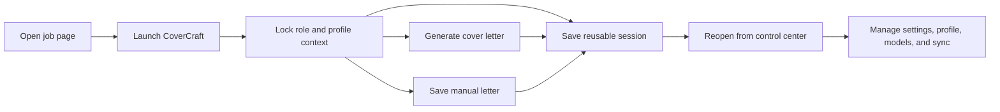

# CoverCraft

CoverCraft is a Chrome extension for faster job applications.

Current release: `3.0.4`

It turns a live job page into a reusable workspace where you can generate a tailored cover letter, ask focused follow-up questions, keep profile context ready, and move into a reusable control center without breaking flow.

## Why CoverCraft

Most job applications break your momentum.

You open the role in one tab, write in another tool, copy profile details from somewhere else, and then repeat the whole process again for the next company.

CoverCraft keeps that process connected.

With CoverCraft, you can:

- open a compact extension panel directly on the job page
- generate a tailored cover letter using the live role context
- paste, edit, save, and download a manual cover letter without making an AI request
- tailor an Overleaf-ready resume draft from the same job and profile context
- ask Q&A follow-ups in the same saved session
- keep one profile ready for reuse
- reopen previous sessions without rebuilding everything
- manage settings, sync, model availability, and account state from one control center

## Release 3.0 Highlights

- Manual mode: save a pasted or edited cover letter as a session artifact and download it as a PDF without using AI.
- On-demand page injection: the extension now injects the page panel from the popup instead of registering a persistent `<all_urls>` content script.
- Model availability: provider request headers, rate limits, cooldowns, and token usage are captured from generation and API tests.
- Dashboard auditability: saved drafts show token usage, ranked evidence, prompt context, cached research, editable letter text, and exportable metrics.
- Cloud sync hardening: sign-in and sync now report local Chrome storage state, Firestore quota details, background sync progress, and model usage sync.
- Site polish: mobile navigation, docked header behavior, carousel arrows, responsive product screenshots, and third-party analytics script removal.
- Firebase cleanup: hosted auth helper pages were removed from the repo; extension sign-in stays on the `chrome.identity` flow.

## Core Product Flow



1. Open a job page
2. Launch CoverCraft on that page
3. Open Settings and import or create your own profile
4. Lock the role, company, and profile context
5. Add your own OpenRouter or Groq key; add Tavily only if you want company research
6. Generate a tailored cover letter
7. Optionally save a manual cover letter without AI
8. Ask focused follow-up questions in the same session
9. Reuse the session later from the control center

## What’s In This Repo

This repo contains:

- the Chrome extension runtime
- the popup, options, dashboard, and content scripts
- the static marketing site and account page under `site/`
- Firebase hosting and Firestore rules for the hosted surfaces
- branding assets used by the landing page and account page
- the reproducible Chrome Web Store packaging script under `scripts/`
- the optional Remotion demo-video source under `video/`
- a post-approval launch checklist in `TODO.md`

Release history is documented in [CHANGELOG.md](CHANGELOG.md). Security and secret-handling guidance is in [SECURITY.md](SECURITY.md).

## Quick Start

### Official Chrome Web Store installation

Use the official listing for Google sign-in and optional Firebase sync:

- `https://chromewebstore.google.com/detail/apnbkjkgobikeejmfjgnmbflonmbgffg`

The production extension ID is `apnbkjkgobikeejmfjgnmbflonmbgffg`. CoverCraft enables production OAuth only when `chrome.runtime.id` matches that ID.

### Local ZIP installation

For BYOK development or local-only use:

- `site/downloads/CoverCraft-extension.zip`

The public ZIP is built from an explicit allowlist of files Chrome needs to run CoverCraft. It includes the manifest, icons, runtime pages and scripts, resume-import tooling, vendor libraries, and public Firebase project identifiers. The marketing website and branding media remain hosted at `cover-craft.app` and are not duplicated in the extension package.

Chrome assigns an unpacked ZIP a different extension ID. The ZIP therefore supports BYOK generation, local profile import, local sessions, and exports, but production Google sign-in and Firebase sync are deliberately unavailable.

The production fallback profile is intentionally empty. Each user must import or create their own profile before generating personalized output. No developer profile or provider API key is included in the ZIP.

To install from the ZIP:

1. Download `CoverCraft-extension.zip`
2. Unzip it locally
3. Open `chrome://extensions`
4. Enable `Developer mode`
5. Click `Load unpacked`
6. Select the unzipped CoverCraft folder

If Chrome shows `An unknown error occurred when fetching the script`, re-download the latest ZIP, unzip it again, and load the extracted folder that contains `manifest.json`. Also confirm you are testing on a normal `https://` job page; Chrome blocks extension injection on browser settings pages, the Chrome Web Store, other extension pages, and local `file://` pages unless file access is enabled for CoverCraft.

### Load the extension

1. Open `chrome://extensions`
2. Enable `Developer mode`
3. Click `Load unpacked`
4. Select this repo root

### Local profile

Copy `src/portfolio.example.js` to `src/portfolio.js` to use local profile data during development.

Developer-owned provider keys must not be placed in the extension package. Users add their own OpenRouter, Groq, and Tavily keys in CoverCraft Settings; those values stay in extension-local storage and are not placed in Chrome Sync or Firebase.

`src/portfolio.js` is local-only and is ignored by Git. Legacy `src/config.js` files are not used by production builds.

### Optional Firebase setup

Production Google sign-in and cloud sync are configured in `src/firebase.defaults.js` and restricted to the official Chrome Web Store ID. A local `src/firebase.js` may override project values during development, but it does not bypass the production-ID gate.

More details are in `firebase/README.md`.

Google sign-in and Firestore sync also require the external Firebase and Google Cloud console configuration documented there. Those console settings and deployed Firestore rules cannot be embedded in or proven solely from the ZIP.

## Website

The `site/` folder contains the CoverCraft landing page and the hosted account surface.

The landing page shows:

- the product flow
- setup steps
- real product screens
- reusable dashboard and account surfaces

The site intentionally avoids third-party analytics scripts in the checked-in pages.

## Local Verification

Useful checks:

```bash
node --check src/background/background.js
node --check src/content/content.js
node --check src/dashboard/dashboard.js
node --check src/options/options.js
node --check src/popup/popup.js
node --check site/app.js
```

Build and verify the same archive uploaded to the Chrome Web Store:

```bash
./scripts/build-extension.sh
unzip -t site/downloads/CoverCraft-extension.zip
```

The build fails if required runtime files are missing or if it detects local configuration, personal portfolio files, environment files, or provider-key patterns.

## Demo Video

The optional product-video source is documented in [video/README.md](video/README.md), with the storyboard in [DEMO_VIDEO_PLAN.md](DEMO_VIDEO_PLAN.md). Its copied media, dependencies, and rendered output are generated locally and excluded from Git.

## Notes

- Personal profile data should stay in `src/portfolio.js`
- Never package developer-owned provider API keys
- Build release ZIPs with `./scripts/build-extension.sh`; it rejects local config files and provider-key patterns
