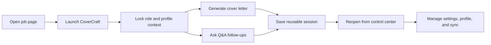

# CoverCraft

CoverCraft is a Chrome extension for faster job applications.

It turns a live job page into a reusable workspace where you can generate a tailored cover letter, ask focused follow-up questions, keep profile context ready, and move into a reusable control center without breaking flow.

## Why CoverCraft

Most job applications break your momentum.

You open the role in one tab, write in another tool, copy profile details from somewhere else, and then repeat the whole process again for the next company.

CoverCraft keeps that process connected.

With CoverCraft, you can:

- open a compact extension panel directly on the job page
- generate a tailored cover letter using the live role context
- ask Q&A follow-ups in the same saved session
- keep one profile ready for reuse
- reopen previous sessions without rebuilding everything
- manage settings, sync, and account state from one control center

## Core Product Flow



1. Open a job page
2. Launch CoverCraft on that page
3. Lock the role, company, and profile context
4. Generate a tailored cover letter
5. Ask focused follow-up questions in the same session
6. Reuse the session later from the control center

## What’s In This Repo

This repo contains:

- the Chrome extension runtime
- the popup, options, dashboard, and content scripts
- the static marketing site and account page under `site/`
- Firebase hosting and Firestore rules for the hosted surfaces
- branding assets used by the landing page and account page

## Quick Start

### Load the extension

1. Open `chrome://extensions`
2. Enable `Developer mode`
3. Click `Load unpacked`
4. Select this repo root

### Add local keys

Copy:

- `src/config.example.js` to `src/config.js`
- `src/portfolio.example.js` to `src/portfolio.js`

Then add:

- your OpenRouter key
- your Groq key
- your Tavily key

`src/config.js` and `src/portfolio.js` are local-only and are ignored by Git.

### Optional Firebase setup

If you want Google sign-in and cloud sync, provide your Firebase config in:

- `src/firebase.js`

That file is now ignored by Git on purpose so project-specific auth config stays local unless you intentionally publish it.

More details are in `firebase/README.md`.

## Website

The `site/` folder contains the CoverCraft landing page and the hosted account surface.

The landing page shows:

- the product flow
- setup steps
- real product screens
- reusable dashboard and account surfaces

## Local Verification

Useful checks:

```bash
node --check src/background/background.js
node --check src/content/content.js
node --check src/dashboard/dashboard.js
node --check src/options/options.js
node --check src/popup/popup.js
node --check site/app.js
```

## Notes

- Personal keys should stay in `src/config.js`
- Personal profile data should stay in `src/portfolio.js`
- Firebase project auth config should stay in `src/firebase.js` unless you intentionally want it public
