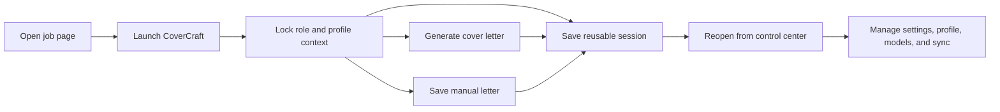

# CoverCraft

CoverCraft is a Chrome extension for faster job applications.

Current release: `3.0`

It turns a live job page into a reusable workspace where you can generate a tailored cover letter, ask focused follow-up questions, keep profile context ready, and move into a reusable control center without breaking flow.

## Why CoverCraft

Most job applications break your momentum.

You open the role in one tab, write in another tool, copy profile details from somewhere else, and then repeat the whole process again for the next company.

CoverCraft keeps that process connected.

With CoverCraft, you can:

- open a compact extension panel directly on the job page
- generate a tailored cover letter using the live role context
- paste, edit, save, and download a manual cover letter without making an AI request
- tailor an Overleaf-ready resume draft from the same job and profile context
- ask Q&A follow-ups in the same saved session
- keep one profile ready for reuse
- reopen previous sessions without rebuilding everything
- manage settings, sync, model availability, and account state from one control center

## Release 3.0 Highlights

- Manual mode: save a pasted or edited cover letter as a session artifact and download it as a PDF without using AI.
- On-demand page injection: the extension now injects the page panel from the popup instead of registering a persistent `<all_urls>` content script.
- Model availability: provider request headers, rate limits, cooldowns, and token usage are captured from generation and API tests.
- Dashboard auditability: saved drafts show token usage, ranked evidence, prompt context, cached research, editable letter text, and exportable metrics.
- Cloud sync hardening: sign-in and sync now report local Chrome storage state, Firestore quota details, background sync progress, and model usage sync.
- Site polish: mobile navigation, docked header behavior, carousel arrows, responsive product screenshots, and third-party analytics script removal.
- Firebase cleanup: hosted auth helper pages were removed from the repo; extension sign-in stays on the `chrome.identity` flow.

## Core Product Flow



1. Open a job page
2. Launch CoverCraft on that page
3. Lock the role, company, and profile context
4. Generate a tailored cover letter
5. Optionally save a manual cover letter without AI
6. Ask focused follow-up questions in the same session
7. Reuse the session later from the control center

## What’s In This Repo

This repo contains:

- the Chrome extension runtime
- the popup, options, dashboard, and content scripts
- the static marketing site and account page under `site/`
- Firebase hosting and Firestore rules for the hosted surfaces
- branding assets used by the landing page and account page
- a post-approval launch checklist in `TODO.md`

## Quick Start

### Download the ZIP

For a direct install package, use:

- `site/downloads/CoverCraft-extension.zip`

The public ZIP is built from an explicit allowlist of files Chrome needs to run CoverCraft. It includes the extension manifest, icons, runtime scripts, dashboard/options/popup pages, sandbox tooling, vendor libraries, Firebase runtime config, and referenced internal site assets. It intentionally excludes `.git`, local-only API keys, local portfolio data, the hosted download folder, demo pages, unused media, and development metadata.

To install from the ZIP:

1. Download `CoverCraft-extension.zip`
2. Unzip it locally
3. Open `chrome://extensions`
4. Enable `Developer mode`
5. Click `Load unpacked`
6. Select the unzipped CoverCraft folder

If Chrome shows `An unknown error occurred when fetching the script`, re-download the latest ZIP, unzip it again, and load the extracted folder that contains `manifest.json`. Also confirm you are testing on a normal `https://` job page; Chrome blocks extension injection on browser settings pages, the Chrome Web Store, other extension pages, and local `file://` pages unless file access is enabled for CoverCraft.

### Load the extension

1. Open `chrome://extensions`
2. Enable `Developer mode`
3. Click `Load unpacked`
4. Select this repo root

### Add local keys

Copy:

- `src/config.example.js` to `src/config.js`
- `src/portfolio.example.js` to `src/portfolio.js`

Then add:

- your OpenRouter key
- your Groq key
- your Tavily key

`src/config.js` and `src/portfolio.js` are local-only and are ignored by Git.

### Optional Firebase setup

If you want Google sign-in and cloud sync, provide your Firebase config in:

- `src/firebase.js`

That file is now ignored by Git on purpose so project-specific auth config stays local unless you intentionally publish it.

More details are in `firebase/README.md`.

## Website

The `site/` folder contains the CoverCraft landing page and the hosted account surface.

The landing page shows:

- the product flow
- setup steps
- real product screens
- reusable dashboard and account surfaces

The site intentionally avoids third-party analytics scripts in the checked-in pages.

## Local Verification

Useful checks:

```bash
node --check src/background/background.js
node --check src/content/content.js
node --check src/dashboard/dashboard.js
node --check src/options/options.js
node --check src/popup/popup.js
node --check site/app.js
```

## Notes

- Personal keys should stay in `src/config.js`
- Personal profile data should stay in `src/portfolio.js`
- Firebase project auth config should stay in `src/firebase.js` unless you intentionally want it public
